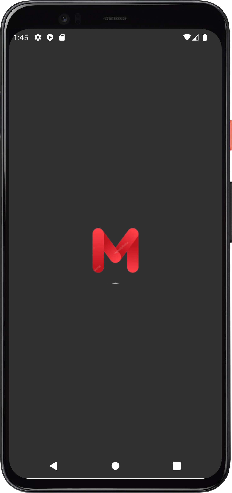
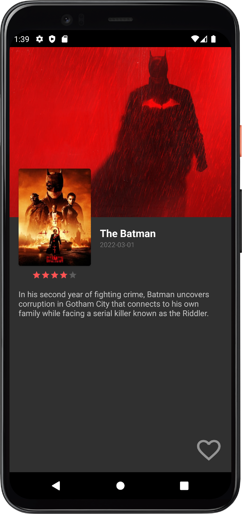
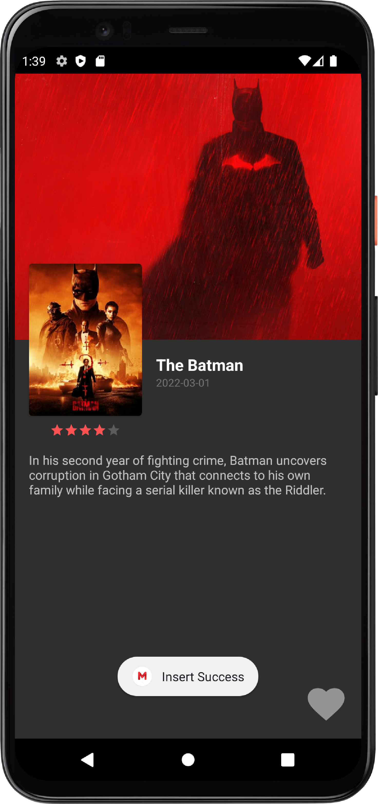
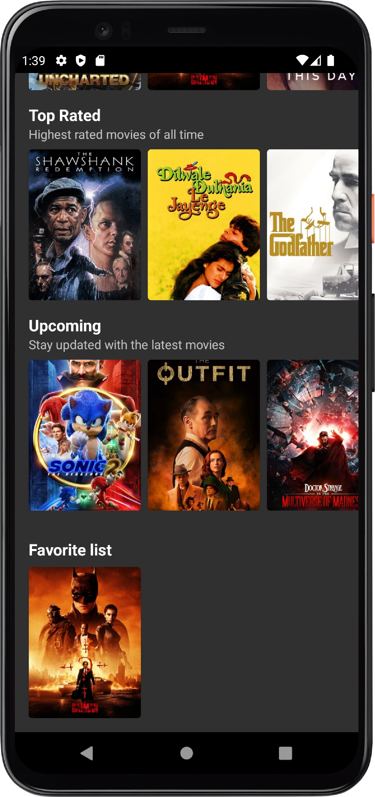
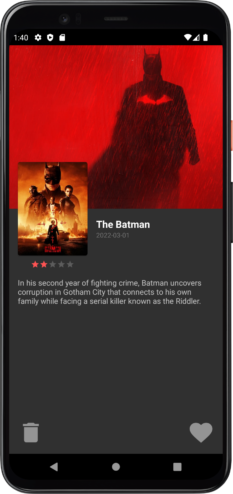

<!-- PROJECT LOGO -->
 

  

  <h3 align="center">Moviefy - Movie base app</h3>

  

    Based on TMDB API + Room, Retrofit, GSON
     
     
    <a href="https://github.com/Nura-21/Moviefy">View Demo</a>
    ·
    <a href="https://github.com/Nura-21/Moviefy/issues">Report Bug</a>
  

  
  
  
 Android-Spring-2022: <strong>Project of Movie base.</strong>
 
    
    Screenshot_1
    
    

    

      
        
        
        
    

    

      
        
        
    

  

  
  
  This project made at Android Devolopment at KBTU, Spring 2022.
  Project: Simple Movie base from TMDB API with minimal features. 
  You can get Popular, Top rated, Upcoming movies, also you can add them to your favorites.
  LIBS: GSON, Retrofit, Glide, Room
  
